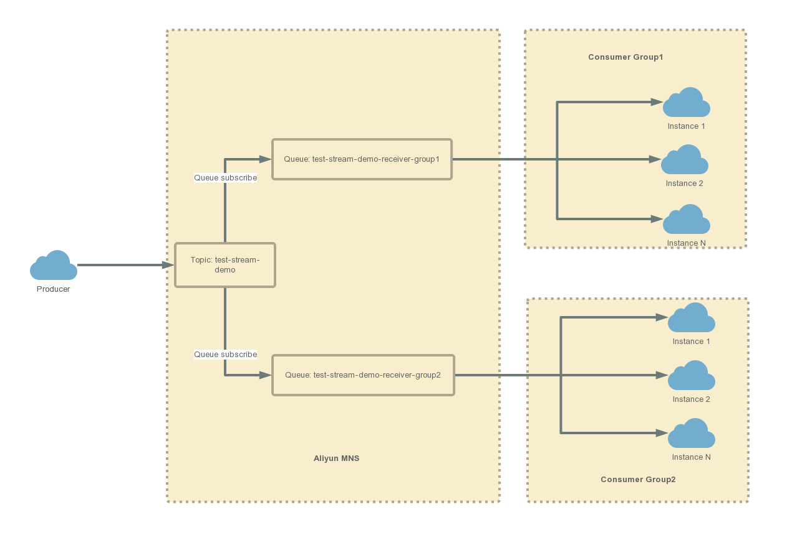

# Spring cloud stream binder Aliyun MNS

实现Aliyun MNS binder，支持分组(group)、分区(partition)

## 配置

MNS配置：

```
spring.cloud.stream.mns.binder.endpoint=
spring.cloud.stream.mns.binder.accessId=
spring.cloud.stream.mns.binder.accessKey=
```

## 实现
每个channel定义为一个topic；

分组实现方式：使用队列订阅主题，每个group消费单独的队列；


分区实现方式：使用filterTag实现消息分区；
